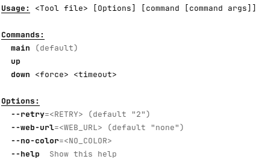
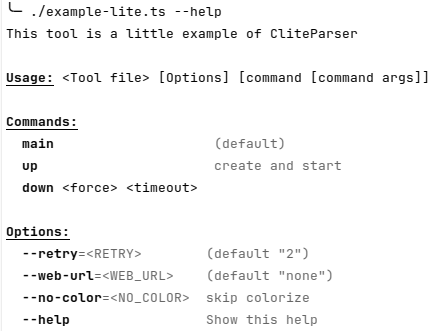

# CLI lite parser for Node and Deno

**CliteParser generate CLI from a class**, each method generate a "command",
each field generate an "option" :

For Node and Deno (prefer ts import for deno):

```typescript
// for Node usage:
import { cliteRun } from "clite-parser"; // after "npm install clite-parser"
// or for Deno usage:
#!/usr/bin/env -S deno run
import { cliteRun } from "https://deno.land/x/clite_parser@0.2.0/clite_parser.ts";

class Tool {
  retry = 2;
  webUrl = "none"; // fields are converted to kebab case as global options
  no_color; // → --no-color

  main() {
    console.log("main command", this);
  }
  up() {
    console.log("up command", this);
  }
  down(force, timeout) {
    console.log("down command", { force, timeout }, this);
  }
}

cliteRun(new Tool());
```

## The help is generated automatically:



Plain text (without color and styles in markdown):

```
$ # with Node : "node example-lite-lite.mjs --help"
$ #          or "node --experimental-network-imports example-lite-lite.mjs --help"
$ # with Deno : "deno run example-lite-lite.mjs --help"
$ #          or if the is shebang is present:
$ ./example-lite-lite.ts --help
Usage: <Tool file> [Options] [command [command args]]

Commands:
  main                    (default)
  up
  down <force> <timeout>

Options:
  --retry=<RETRY>        (default "2")
  --web-url=<WEB_URL>    (default "none")
  --no-color=<NO_COLOR>
  --help                 Show this help
```

## Run the commands with options and arguments

```shell
#                   ↓↓↓↓↓↓↓↓↓↓↓↓↓↓↓ options ↓↓↓↓↓↓↓↓↓↓↓ ↓command↓ ↓cmd args↓
$ ./example-lite.ts --retry=4 --web-url=tttt --no-color   down     true  14
down command { force: "true", timeout: "14" } Tool { retry: "4", webUrl: "tttt", no_color: true }

$ ./example-lite.ts down true 14
down command { force: "true", timeout: "14" } Tool { retry: 2, webUrl: "none", no_color: undefined }

$ ./example-lite.ts  --retry=4 --web-url=tttt --no-color
main command Tool { retry: "4", webUrl: "tttt", no_color: true }
```

## Help description

Optional fields `_<filed or method name>_desc` are displayed as description in
the help :

```typescript
#!/usr/bin/env -S deno run -A
import { cliteRun } from "https://deno.land/x/clite_parser@0.2.0/clite_parser.ts";

class Tool {
  _desc = "This tool is a little example of CliteParser"; // optional description
  retry = 2;
  webUrl = "none"; // fields are converted to kebab case as global options
  no_color?: string | boolean; // → --no-color
  _no_color_desc = "skip colorize"; // optional description for "no_color" field
  _up_desc = "create and start"; // optional description for "up" command

  main() {
    console.log("main command", this);
  }

  up() {
    console.log("up command", this);
  }

  down(force: boolean, timeout: number) {
    console.log("down command", { force, timeout }, this);
  }
}

if (import.meta.main) { // if the file is imported, do not execute this block
  cliteRun(new Tool());
}
```



Plain text (without color and styles in markdown):

```
This tool is a little example of CliteParser

Usage: <Tool file> [Options] [command [command args]]

Commands:
  main                    (default)
  up                      create and start
  down <force> <timeout>

Options:
  --retry=<RETRY>        (default "2")
  --web-url=<WEB_URL>    (default "none")
  --no-color=<NO_COLOR>  skip colorize
  --help                 Show this help
```

## Default command

- If there is only one method/command => this method is the default
- If the main method exist => main is the default
- else => no default method

```shell
$ ./example-lite.ts
main command Tool { retry: 2, webUrl: "none", no_color: undefined }
```

## Ignore _* methods and fields (in the help)

Fields and methods that start with "_" are ignored.

```typescript
_privateData = 12;
_privmethod();
{
  console.log("this method is not visible in the help (starts with '_')");
}
```

Note: this "private" method can be run by the CLI, it's useful during the
development.

## Boolean options

```shell
$ ./example-lite.ts
main command Tool { retry: 2, webUrl: "none", no_color: undefined }
$ ./example-lite.ts --no-color
main command Tool { retry: 2, webUrl: "none", no_color: true }
$ ./example-lite.ts --no-color=false
main command Tool { retry: 2, webUrl: "none", no_color: "false" }
$ ./example-lite.ts --no-color=true
main command Tool { retry: 2, webUrl: "none", no_color: "true" }
```

## Return value

If the method run by `cliteRun` return a value != undefined, it will be print in
stdout.

This behavior can be disabled with the config :
`cliteRun(new Tool(), { dontPrintResult: true } )`

## cliteRun config

`cliteRun(new Tool(), { args: ... } )`

```typescript
type CliteRunConfig = {
  args?: string[]; // default : Deno.args
  dontPrintResult?: boolean; // default : false
};
```

## Node support : npm install clite-parser

### Usage from NPM

Run `npm i clite-parser` and import with
`import { cliteRun } from "clite-parser";` :

```javascript
import { cliteRun } from "clite-parser"; // after "npm i clite-parser"
class Tool { ... }
cliteRun(new Tool());
```

→ See [example/node/simple](example/node/simple) folder example

### Usage with [--experimental-network-imports](https://nodejs.org/api/esm.html#https-and-http-imports) node option :

Import directly by http :

```javascript
// run with "node --experimental-network-imports ./example.mjs"
import { cliteRun } from "https://deno.land/x/clite_parser@0.2.0/clite_parser.mjs";
```

And run the script with:

```shell
$ node --experimental-network-imports ./example.mjs
```

## Links

- https://deno.land/x/clite_parser/
- https://www.npmjs.com/package/clite-parser
