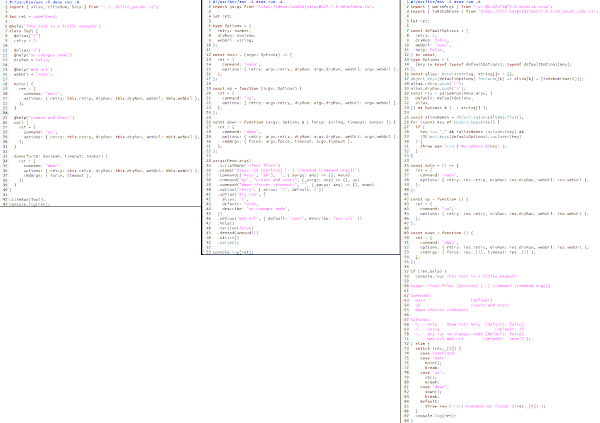

# CLI lite parser for Node and Deno

[](https://jsr.io/@jersou/clite)
[](https://jsr.io/@jersou/clite)
[](https://jsr.io/@std)

**CliteParser generates CLI from classes** (or objects) : each field generates
an "option", each method generates a "command" (positional arguments).

Just write your tool as a class, and call Clite with it... Clite will
deserialize the command line in your class and launch the right methods or
display the help... Then you can optionally personalize the displayed help or
add aliases (for example) to complete your CLI.

```typescript
#!/usr/bin/env -S deno run
import { cliteRun } from "jsr:@jersou/clite@0.7.3";
// or after "deno add @jersou/clite" : import { cliteRun } from "@jersou/clite";
// or for Node usage : import { cliteRun } from "clite-parser"; // after "npm install clite-parser"

class Tool {
  retry = 2; // 2 is the default value, overwrite by "--retry 8" by example
  dryRun = false; // fields are converted to kebab case as global options
  webUrl = "none"; // → --web-url

  main() { // call if : $ ./example-lite-lite.ts main // or if $ ./example-lite-lite.ts
    console.log("main command", this);
  }

  up() { // call if : $ ./example-lite-lite.ts up
    console.log("up command", this);
  }

  down(force: boolean, timeout: number) { // call if : $ ./example-lite-lite.ts down true 14
    console.log("down command", { force, timeout }, this);
  }
}

cliteRun(Tool); // or cliteRun(new Tool());
```

## The help is generated automatically:


<!-- Plain text (without color and styles in markdown):
$ ./simple.ts --help
Usage: <Tool file> [Options] [--] [command [command args]]

Commands:
  main                   [default]
  up
  down <force> <timeout>

Options:
 -h, --help    Show this help [default: false]
     --retry                      [default: 2]
     --dry-run                [default: false]
     --web-url               [default: "none"]
-->

## Run the commands with options and arguments

```shell
#             ↓↓↓↓↓↓↓↓↓↓↓↓↓ options ↓↓↓↓↓↓↓↓↓↓↓↓  ↓ command ↓  ↓ cmd args ↓
$ ./simple.ts --dry-run --web-url=tttt --retry 4     down        true  14
down command { force: true, timeout: 14 } Tool { retry: 4, dryRun: true, webUrl: "tttt" }

$ ./simple.ts down true 14                     #  ↓↓↓  default options from class init  ↓↓↓
down command { force: true, timeout: 14 } Tool { retry: 2, webUrl: "none", no_color: undefined }

$ ./simple.ts --dry-run --webUrl=tttt # ← same case of the field name works too : --webUrl or --web-url
main command Tool { retry: 2, dryRun: true, webUrl: "tttt" } # ← main is the default command

$ deno https://raw.githubusercontent.com/jersou/clite-parser/refs/heads/main/examples/simple.ts --dry-run --web-url tttt --retry 4 down true  14
down command { force: true, timeout: 14 } Tool { retry: 4, dryRun: true, webUrl: "tttt" }
```

## Examples

Several examples can be found in the [examples/](./examples) folder.

### Full example with decorators (Typescript)

Works with vanilla typescript or with experimentalDecorators = true

```typescript
import { alias, cliteRun, help } from "jsr:@jersou/clite@0.7.3";

@help("This tool is a little example of CliteParser") // optional description
class Tool {
  @alias("r") // optional alias -r for --retry
  retry = 2;
  @help("no changes mode") // optional description for "--dry-run" field
  dryRun = false; // fields are converted to kebab case as global options
  webUrl = "none"; // → --web-url

  main() {
    console.log("main command", this);
  }

  @help("create and start") // optional description for "up" command
  up() {
    console.log("up command", this);
  }

  down(force: boolean, timeout: number) {
    console.log("down command", { force, timeout }, this);
  }
}

cliteRun(Tool); // or cliteRun(new Tool());
```

The help is generated automatically:


<!-- Plain text (without color and styles in markdown):
$ ./with-decorators.ts --help
This tool is a little example of CliteParser

Usage: <Tool file> [Options] [--] [command [command args]]

Commands:
  main                   [default]
  up                     create and start
  down <force> <timeout>

Options:
 -h, --help    Show this help  [default: false]
 -r, --retry                       [default: 2]
     --dry-run no changes mode [default: false]
     --web-url                [default: "none"]
-->

### Full example without decorator (Javascript)

```javascript
import { cliteRun } from "jsr:@jersou/clite@0.7.3";

class Tool {
  _help = "This tool is a little example of CliteParser"; // optional description

  _retry_alias = "r"; // optional alias -r for --retry
  retry = 2;
  _dryRun_help = "no changes mode"; // optional description for "--dry-run" field
  dryRun = false; // fields are converted to kebab case as global options
  webUrl = "none"; // → --web-url

  main() {
    console.log("main command", this);
  }

  _up_help = "create and start"; // optional description for "up" command
  up() {
    console.log("up command", this);
  }

  down(force, timeout) {
    console.log("down command", { force, timeout }, this);
  }
}

cliteRun(Tool); // or cliteRun(new Tool());
```

The help is generated automatically (same as the previous):


<!--  Plain text (without color and styles in markdown):
./without-decorator.mjs --help
This tool is a little example of CliteParser

Usage: <Tool file> [Options] [--] [command [command args]]

Commands:
  main                   [default]
  up                     create and start
  down <force> <timeout>

Options:
 -h, --help    Show this help  [default: false]
 -r, --retry                       [default: 2]
     --dry-run no changes mode [default: false]
     --web-url                [default: "none"]
-->

## `cliteRun()` usage

`cliteRun()` function takes an object or a class as input, and an optional
config, see [CliteRunConfig](#CliteRunConfig) chapter bellow.

Exemple : `cliteRun(Tool)` or `cliteRun(new Tool())` or
`cliteRun(Tool, { noCommand: true })`

## `cliteParse()` usage

Same as `cliteRun()`, but not run the command, return the parsing "CliteResult"
that contains:

- obj:The input object overwritten with the data from the parsing result
- command: The command to run from the parsing result
- commandArgs: The command arguments from the parsing result
- config: The input CliteRunConfig
- help: The generated help;
- subcommand: The subcommand CliteResult if the command is a subcommand

## Ignore `_*` and `#*` methods and fields (in the help)

Fields and methods that start with "_" are ignored.

```typescript
_privateData = 12;
_privateMethod() {
  console.log("this method is not visible in the help (starts with '_')");
}
```

Note: this "private" method can be run by the CLI, it's useful during the
development.

Note2: js private fields `#*` are also ignored :

```typescript
#privateData = 12;
#privateMethod() {
  console.log("this method is not visible in the help (starts with '#')");
}
```

## Decorator `@*` or field `_<field name>_*`

Fields and methods can be extended with description, type or aliases using
decorators or `_<field name>_*` field. Decorator don't work with Javascript (not
in the language) !

In summary :

- `@help(description: string)` | `_<field>_help` : add description on
  class/methods/fields to display in the help
- `@alias(alias: string)` | `_<field>_alias` : add alias on method/command (
  `-n` for example)
- `@type(typeHelp: string)` | `_<field>_type` : type to display in the help
- `@negatable(help: string | boolean = true)` | `_<field>_negatable`: enable
  `--no-<option>` (`--no-dry-run` for example)
- `@defaultHelp(defaultHelp: string)` | `_<field>_default` : default to display
  in the help
- `@usage(usage: string)` | `_<field>_usage` : tool usage to display in the help
- `@hidden()` | `_<field>_hidden`: to hide in the help
- `@subcommand()` | `_<field>_subcommand` : use this field as a subcommand
- `@noCommand()` | `_<field>_no_command` : the tool have no command (only the
  main), process all positional arguments as main() args

### Help description with the `@help` decorator or inline help

```typescript
import { cliteRun, help } from "jsr:@jersou/clite@0.7.3";

@help("This tool is a little example of CliteParser")
class Tool {
  retry = 2;
  webUrl = "none"; // fields are converted to kebab case as global options

  @help("skip colorize") // optional description for "no_color" field
  no_color?: string | boolean; // → --no-color

  main() {
    console.log("main command", this);
  }

  @help("create and start") // optional description for "up" command
  up() {
    console.log("up command", this);
  }

  down(force: boolean, timeout: number) {
    console.log("down command", { force, timeout }, this);
  }
}

cliteRun(Tool);
```

Without decorator : optional fields `_<filed or method name>_help` are displayed
as description in the help :

```typescript
#!/usr/bin/env -S deno run -A
import { cliteRun } from "jsr:@jersou/clite@0.7.3";

class Tool {
  _help = "This tool is a little example of CliteParser"; // optional description
  retry = 2;
  webUrl = "none"; // fields are converted to kebab case as global options
  no_color?: string | boolean; // → --no-color
  _no_color_help = "skip colorize"; // optional description for "no_color" field
  _up_help = "create and start"; // optional description for "up" command

  main() {
    console.log("main command", this);
  }

  up() {
    console.log("up command", this);
  }

  down(force: boolean, timeout: number) {
    console.log("down command", { force, timeout }, this);
  }
}

if (import.meta.main) { // if the file is imported, do not execute this block
  cliteRun(Tool);
}
```

### Alias

Alias of option can be created, with the `@alias` decorator or with
`_<field name>_alias` :

```typescript
#!/usr/bin/env -S deno run -A
import { cliteRun } from "../clite_parser.ts";
import { alias, help, type } from "../src/decorators.ts";

class Tool {
  @alias("a")
  all?: boolean;
  @alias("r")
  retry = 2;
  @alias("w")
  webUrl = "none";

  @alias("nb")
  @alias("n")
  @help("n & b")
  @type("boolean")
  no_color?: string | boolean;

  main() {
    console.log("main command", this);
  }
}
```

Produce the help :

```
...
Options:
       -h, --help     Show this help [default: false]
       -a, --all
       -r, --retry                       [default: 2]
       -w, --web-url                [default: "none"]
 -n, --nb, --no-color n & b                 [boolean]
```

Short parameters can be aggregated, `-an` here :

```
$ ./alias-with-decorator.ts -an -r 8
main command Tool { all: true, retry: 8, webUrl: "none", no_color: true }
```

`-an` = `-a -n`

Example without the @alias decorator :

```typescript
class Tool {
  _all_alias = "a";
  all?: boolean;
  _retry_alias = "r";
  retry = 2;
  _webUrl_alias = "w";
  webUrl = "none";

  _no_color_alias = ["nb", "n"];
  _no_color_help = "n & b";
  _no_color_type = "boolean";
  no_color?: string | boolean;

  main() {
    console.log("main command", this);
  }
}
```

### `@subcommand` decorator and `_*_subcommand`

Use the field (class or object) as a subcommand :

Full exemple in [examples/git-subcommand.ts](examples/git-subcommand.ts)

```typescript
// → <Tool> [--dry-run] [ [up [--watch] <count>] | [down [--volumes] <force> <timeout>] ]
class Up {
  _clite_parent?: Tool;
  watch = false;
  main(_count: number) {
    console.log("Up", this);
  }
}

class Tool {
  dryRun = false;

  @subcommand()
  up = Up;

  @subcommand()
  down = {
    volumes: false,
    main(force: boolean, timeout: number) {
      console.log("Down", this);
    },
  };
}

cliteRun(new Tool());
```

```
./subcommand.ts --help
Usage: <Tool file> [Options] [--] [command [command args]]

Commands:
  up --help | [sub Options / cmd / args]
  down --help | [sub Options / cmd / args]

Options:
 -h, --help    Show this help [default: false]
     --dry-run                [default: false]
     --down         [default: [object Object]]

/$ .subcommand.ts down --help
Usage: <Object file> [Options] [--] [command [command args]]

Command:
  main <force> <timeout> [default]

Options:
 -h, --help    Show this help [default: false]
     --volumes                [default: false]
```

## Argument parsing

Clite use [@std/cli](https://jsr.io/@std/cli/doc/parse-args), based on
[minimist](https://github.com/minimistjs/minimist).

### Kebab case or the same name

Example : `webUrl` field can be set by `--webUrl` or `--web-url`:

```
$ ./simple.ts --web-url test 
main command Tool { retry: 2, dryRun: false, webUrl: "test" }

$ ./simple.ts --webUrl test
main command Tool { retry: 2, dryRun: false, webUrl: "test" }
```

### several ways to pass parameters

For example, for an option `-l, --out-limit` from a field `outLimit` with an
alias `l` :

- `-l=8`
- `-l 8`
- `-l8`
- `--out-limit 8`
- `--out-limit=8`
- `--outLimit 8`
- `--outLimit=8`

Are equivalent.

### Passing boolean

```shell
$ ./example-lite.ts
main command Tool { retry: 2, webUrl: "none", no_color: undefined }
$ ./example-lite.ts --no-color
main command Tool { retry: 2, webUrl: "none", no_color: true }
$ ./example-lite.ts --no-color=false
main command Tool { retry: 2, webUrl: "none", no_color: "false" }
$ ./example-lite.ts --no-color=true
main command Tool { retry: 2, webUrl: "none", no_color: "true" }
```

### Passing arrays :

Use several times an option will fill the field if it's an array :

```
class Tool {
  @alias("a")
  arr: string[] = [];
  ...
}
$ ./Tool.ts --arr=aa --arr bb -a=cc -a dd --a ee
→ arr === ["aa", "bb", "cc", "dd", "ee"]
```

### Passing objects :

Object can be deserialized :

```
--ac.bb aaa --ac.dd.ee v --ac.dd.ff w
```

will fill `ac` field with

```
{ bb: "aaa", dd: { ee: "v", ff: "w" }
```

Example :

```
class Tool {
  ac = {};
  ...
}
$ ./Tool.ts --ac.bb aaa --ac.dd.ee v --ac.dd.ff w
→ ac === { bb: "aaa", dd: { ee: "v", ff: "w" } })
```

### The default command

- If there is only one method/command => this method is the default
- If the main method exist => main is the default
- else => no default method

```shell
$ ./example-lite.ts
main command Tool { retry: 2, webUrl: "none", no_color: undefined }
```

## CliteRunConfig

`cliteRun(Tool, < optional CliteRunConfig > )`

```typescript
type CliteRunConfig = {
  args?: string[]; // default : Deno.args or process.argv.slice(2)
  dontPrintResult?: boolean; // default false : false, print the command return
  noCommand?: boolean; // no default command : do not run "main" methode if no arg
  printHelpOnError?: boolean; // print the help if an error is thrown and then re-throw the error
  mainFile?: string; // allows to change the name of the file in the help, instead of the default <{Class name} file>
  meta?: ImportMeta; // import.meta to use : don't run if the file is imported, and use import.meta.url in the help
  configCli?: boolean; // enable "--config <path|json string>" to load json config, Show in the help if it's a string
  dontConvertCmdArgs?: boolean; // don't convert "true"/"false" to true/false in command arguments, and not to number after --
};
```

### Return value

If the method run by `cliteRun` return a value != undefined, it will be print in
stdout. If it's a promise, the result of the promise will be awaited.

This behavior can be disabled with the config :
`cliteRun(Tool, { dontPrintResult: true })`

### noCommand

No command in the command line → all positional argument are used as arguments
of the command.

The default command is used.

`cliteRun(Tool, { noCommand: true });` → `./example-no-command.ts ---help` give
:

```
This tool is a "no-command" example of CliteParser usage

Usage: <Tool file> [Options] [--] [args]

Options:
  --retry=<RETRY>        (default "2")
  --web-url=<WEB_URL>    web URL ... (default "none")
  --no-color=<NO_COLOR>  skip colorize
  --help                 Show this help
```

## Print the help on error

If printHelpOnError is enabled, the help is print if any error is thrown while
the command execution. Else, the help is print only for errors that have
`{ cause: { clite: true } }`.

It's useful if a required option is missing, for example.

```typescript
import { cliteRun } from "jsr:@jersou/clite@0.7.3";
export class Tool {
  throw = "true";
  main() {
    if (this.throw === "true") {
      throw new Error("add --throw=false option !");
    }
    console.log("OK !");
  }
}
cliteRun(Tool, { printHelpOnError: true });
```

To print help on specific error only, without `printHelpOnError=true`, use
`{ cause: { clite: true } }` :

```typescript
import { cliteRun } from "jsr:@jersou/clite@0.7.3";
export class Tool {
  noThrow = false;

  main() {
    if (!this.noThrow) {
      throw new Error("add --no-throw option !", { cause: { clite: true } });
    }
    console.log("OK !");
  }
}
cliteRun(Tool);
```

### configCli : load a json config with `--config <path | or json string>`

If `configCli === true` in the CliteRunConfig

```
$ cat ./load-config.ts
...
cliteRun(Tool, { configCli: true });

$ ./load-config.ts --help
...
     --config  Use this json file or string to read the options [string]
...

$ ./load-config.ts  down
down command { force: undefined, timeout: undefined } Tool { retry: 2, dryRun: false, webUrl: "none", config: undefined }

$ cat load-config.json
{ "retry": 44, "dryRun": true, "webUrl": "yyy" }

$ ./load-config.ts --retry 88 --config ./load-config.json down
down command { force: undefined, timeout: undefined } Tool {
  retry: 88,
  dryRun: false,
  webUrl: "yyy",
  config: "./load-config.json"
}
```

### mainFile

Allows to change the name of the file in the help, instead of the default for
example `<Tool file>`.

```typescript
cliteRun(Tool, { mainFile: "my-tool" });
```

...will change the usage line in the help :

```
Usage: my-tool [Options] [--] [command [command args]]
```

### meta

Use meta to avoid the import.meta.main check :

```typescript
if (import.meta.main) { // if the file is imported, do not execute this block
  cliteRun(Tool);
}
```

is equivalent to :

```typescript
cliteRun(Tool, { meta: import.meta });
```

The basename of import.meta.url will be used in the generated help, as
"mainFile".

This feature does not work with Node (no import.meta.main).

### dontConvertCmdArgs

If `--` is used and dontConvertCmdArgs=true, all command arguments will be
strings.

```
# with dontConvertCmdArgs: true
$ ./Tool.ts -- main 123 true foo
 → command = main
 → commandArgs = ["123", "true", "foo"]);

# with dontConvertCmdArgs: false
$ ./Tool.ts -- main 123 true foo
 → command = main
 → commandArgs = 123, true, "foo"]);
```

## Plain Object

A plain JS Object can be used :

```typescript
import { cliteRun } from "jsr:@jersou/clite@0.7.3";

cliteRun({
  retry: 2,
  main() {
    console.log("main command", this);
  },
  _up_help: "create and start the services",
  up(svc: string, timeout = 10) {
    console.log("up command", { svc, timeout, retry: this.retry });
  },
  down(svc: string) {
    console.log("down command", { svc, retry: this.retry });
  },
});
```

```shell
$ ./plain_object_lite.ts --retry=77 up foo 123
up command { svc: "foo", timeout: 123, retry: 77 }

$ /plain_object_lite.ts --help
Usage: <Object file> [Options] [--] [command [command args]]

Commands:
  main               [default]
  up <svc> <timeout> create and start the services
  down <svc>

Options:
 -h, --help  Show this help [default: false]
     --retry                    [default: 2]
```

## Node support : `npm install clite-parser` or `npx jsr add @jersou/clite`

### From NPM : `npm install clite-parser`

Run `npm install clite-parser` and then, import with
`import { cliteRun } from "clite-parser";` :

```javascript
import { cliteRun } from "clite-parser"; // after "npm install clite-parser"
class Tool { ... }
cliteRun(Tool);
```

See node usage examples :

- [examples/node-npm/dax](examples/node-npm/dax)
- [examples/node-npm/simple](examples/node-npm/simple)
- [examples/node-npm/zx](examples/node-npm/zx)

### From JSR : `npx jsr add @jersou/clite`

Run `npx jsr add @jersou/clite` and then, import with
`import { cliteRun } from "@jersou/clite";` :

```javascript
import { cliteRun } from "@jersou/clite"; // after "npx jsr add @jersou/clite"
class Tool { ... }
cliteRun(Tool);
```

See node usage examples :

- [examples/node-jsr/dax](examples/node-jsr/dax)
- [examples/node-jsr/simple](examples/node-jsr/simple)
- [examples/node-jsr/zx](examples/node-jsr/zx)

## Links

- https://jsr.io/@jersou/clite
- https://github.com/jersou/clite-parser
- https://www.npmjs.com/package/clite-parser

## Dependencies (all)

- `@std/cli` : to parse args
- `@std/fmt` : to log with colors/bold
- `@std/text` : to change case
- `@std/assert` : to test

## Inspiration

Probably inspired by:

- [Bash-utils](https://github.com/jersou/bash-utils#principes) : run bash
  function from CLI with `utils:run "$@"`,
- and by [Clap](https://github.com/clap-rs/clap) (one year) after the
  development of [mouse-actions](https://github.com/jersou/mouse-actions) :
  deserialize options from CLI to struct.

## to try in a browser

With [esm.sh](https://code.esm.sh/),
[playcode.io](https://playcode.io/javascript),
[jsfiddle.net](https://jsfiddle.net/)) :

```javascript
import { cliteParse } from "https://esm.sh/jsr/@jersou/clite@0.7.3";

class Tool {
  opt = 123;
  main() {}
}

const res = cliteParse(Tool, { args: ["--opt", "78"] });
console.log(res);
```

## Comparison with other tools : Yars, @std/cli (minimist)

The usual tools rather take a particular configuration of the tool and produce
an output data **without** a defined model. You need to learn their API to
define the interface you want.

**Clite follows a different approach: it takes the desired model and fills it
according to the command line**. If you want to type the parsing output, you
don't need to do anything else. No duplicate writing for the CLI config and the
parsing output model/type.

And of course, like classic tools, it also generates the help automatically,
detects the non-existent option/order errors, and launches the desired command
with its parameters.

A comparison try is made in the
[examples/cli-tools-diff](examples/cli-tools-diff) folder, it compares

- Clite : [examples/cli-tools-diff/clite.ts](examples/cli-tools-diff/clite.ts)
- vs [Yargs](https://github.com/yargs/yargs) :
  [examples/cli-tools-diff/yargs.ts](examples/cli-tools-diff/yargs.ts)
- vs [@std/cli](https://jsr.io/@std/cli/doc/parse-args) based on
  [minimist](https://github.com/minimistjs/minimist) :
  [examples/cli-tools-diff/std-cli.ts](examples/cli-tools-diff/std-cli.ts)

These 3 files provide the same CLI :

```
Usage: <Tool file> [Options] [--] [command [command args]]

Commands:
  main                   [default]
  up                     create and start
  down <force> <timeout>

Options:
 -h, --help    Show this help  [default: false]
 -r, --retry                       [default: 2]
 -n, --dry-run no changes mode [default: false]
     --web-url web url        [default: "none"]
```

The 3 implementations side by side :

[](examples/cli-tools-diff/diff.png)

## Real case

- The project
  [Studio-Pack-Generator](https://github.com/jersou/studio-pack-generator) use
  clite and have
  [lots of CLI options](https://github.com/jersou/studio-pack-generator?tab=readme-ov-file#cli-usage)
  generated from
  [a rather understandable file](https://github.com/jersou/studio-pack-generator/blob/main/studio_pack_generator.ts)
  (in my opinion, of course).
- simpler example : [examples/dcpps.ts](examples/dcpps.ts)
- even simpler : [examples/dcpm.ts](examples/dcpm.ts)

# TODO

- check call of cmd `_...`
